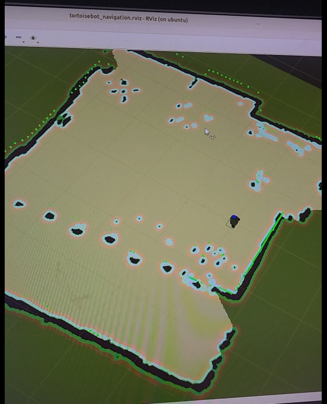
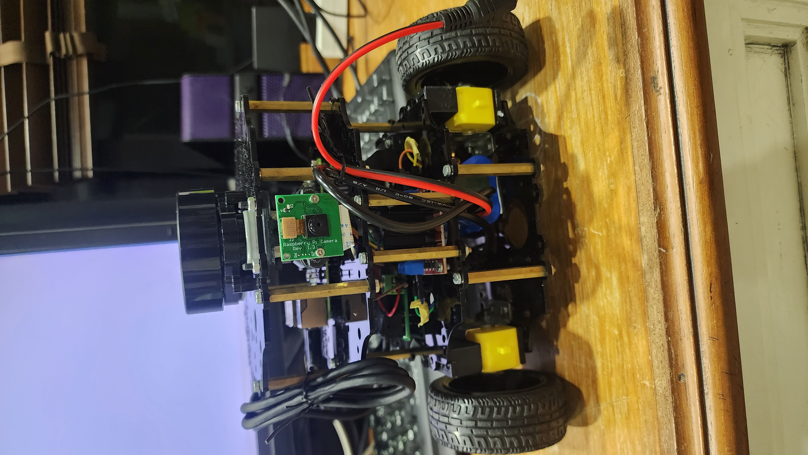
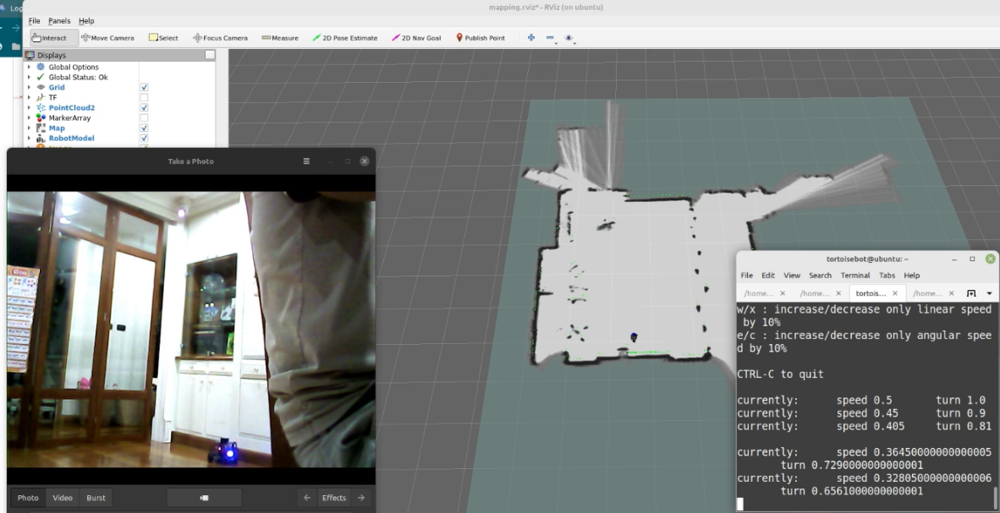
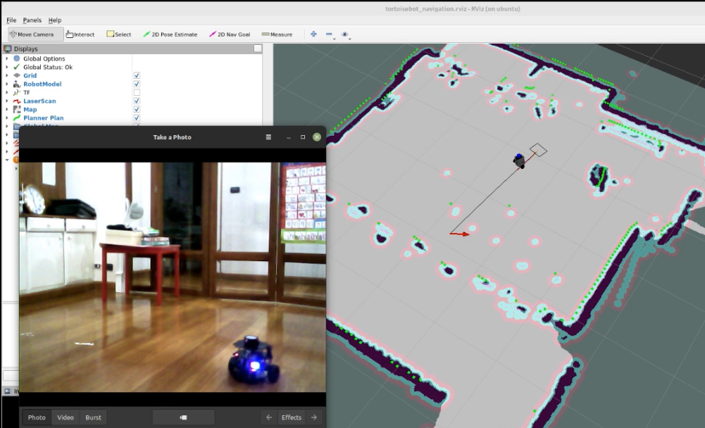
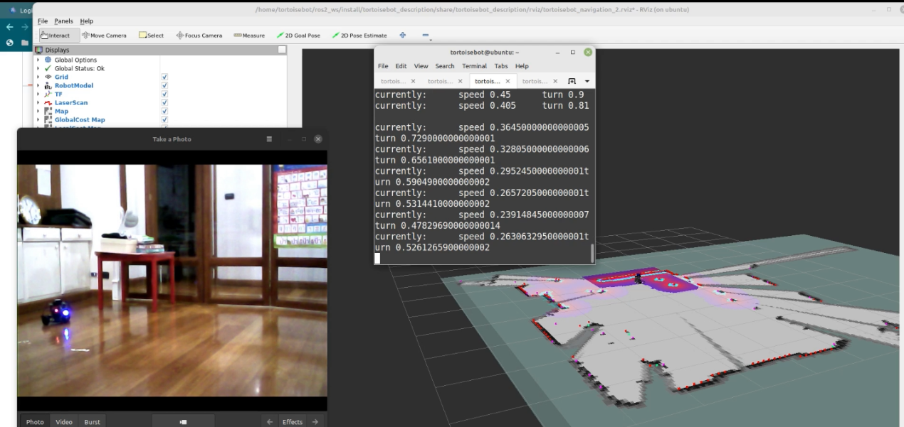
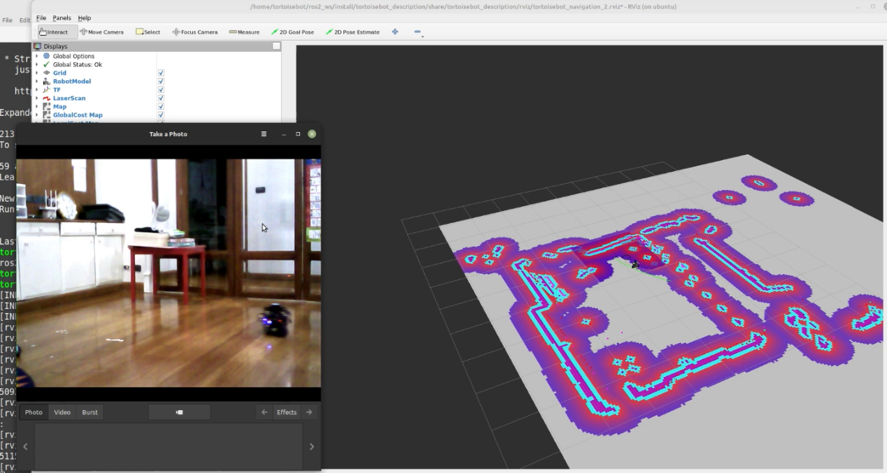

# Checkpoint 20 Tortoisebot and Navigation

command for checkpoint 20

## Connection to Robot

To find tortoisebot IP address

```
nmap -sP 192.168.3.1/24
```

how to ssh

```
ssh tortoisebot@192.168.3.4
```

or if you need to transfer X windows to the working computer

```
ssh -X tortoisebot@192.168.3.4
```


```
username: tortoisebot
password:raspberry
```

All terminal must call

```
noetic
```

before any commands

- To go straight forward in x direction

```
rostopic pub -1 /cmd_vel geometry_msgs/Twist '{linear:  {x: 0.1, y: 0.0, z: 0.0}, angular: {x: 0.0,y: 0.0,z: 0.0}}'
```

- To stop

```
rostopic pub -1 /cmd_vel geometry_msgs/Twist '{linear:  {x: 0, y: 0.0, z: 0.0}, angular: {x: 0.0,y: 0.0,z: 0.0}}'
```


To Visualize sensors the Rviz
Terminal 1


```
roslaunch tortoisebot_firmware bringup.launch
```

Terminal 2

```
rviz -d ~/Documents/peerajak_rviz.rviz

```

## Save flash drive for later roll back

To save flash drive to file .img

```
 sudo dd if=/dev/sdd of=$PWD/system_boot_2.img status=progress
```


To mount the flash drive save file .img 

- system-boot partition


```
sudo mount -o loop,offset=269484032 system_boot_2.img /media/peerajak/
```

- writable partition

```
fdisk -l system_boot_2.img
```

the result:

```
Device             Boot  Start      End  Sectors  Size Id Type
system_boot_2.img1 *      2048   526335   524288  256M  c W95 FAT32 (LBA)
system_boot_2.img2      526336 62333918 61807583 29.5G 83 Linux
```

use number in Start column and multiply with 512, to get offset value. and then, similar to system-boot partition
replace offset value to the one you just calculated.

```
sudo mount -o loop,offset=269484032 system_boot_2.img /media/peerajak/
```


To Unmount the above commands

```
sudo umount /media/peerajak/
```

## Ros1 Navigation

### Cartographer_ros package installation

Dependencies:

```
sudo apt-get install ros-noetic-map-server ros-noetic-move-base ros-noetic-navigation ros-noetic-dwa-local-planner ros-noetic-ira-laser-tools ros-noetic-teleop-twist-keyboard
```

Install Google-Cartographer

```
sudo apt-get update
sudo apt-get install -y python3-wstool python3-rosdep ninja-build stow
```

After the tools are installed, create a new 'carto_ws' workspace inside your existing ‘ros1_ws’.

```
mkdir ~/ros1_ws/carto_ws
cd ~/ros1_ws/carto_ws
wstool init src
wstool merge -t src https://raw.githubusercontent.com/cartographer-project/cartographer_ros/master/cartographer_ros.rosinstall
wstool update -t src
sudo rosdep init
rosdep update
rosdep install --from-paths src --ignore-src --rosdistro=${ROS_DISTRO} -y
```

if you face a problem, do the following:

```
sudo vi ~/ros1_ws/carto_ws/src/cartographer/package.xml
```

go to line number 46 and comment it out

```
<!-- <depend>libabsl-dev</depend> -->
```

then cd into src and clone the following repositories

```
git clone -b melodic-devel https://github.com/ros-perception/perception_pcl.git
git clone https://github.com/ros-perception/pcl_msgs
git clone -b noetic-devel https://github.com/jsk-ros-pkg/geometry2_python3.git
```

and then go back to carto_ws and run

```
rosdep install --from-paths src --ignore-src --rosdistro=${ROS_DISTRO} -y
src/cartographer/scripts/install_abseil.sh
```

Run this from carto_ws:

```
catkin_make_isolated --install --use-ninja -j1 -l1
```

To overlay the ros1_ws/carto_ws over ros1_ws for the first time

```
cd ~/ros1_ws/carto_ws/
source ~/ros1_ws/carto_ws/devel_isolated/setup.bash
cd ~/ros1_ws
rm -rf devel install install_isolated devel_isolated
catkin_make -j1 -l1
source ~/ros1_ws/devel/setup.bash
```

To call overlayed workspace

```
source ~/ros1_ws/carto_ws/devel_isolated/setup.bash
source ~/ros1_ws/devel/setup.bash

```

or call 

```
./ros1_ws/chain_setup.bash
```

To check that everything is set up, we need to see both cartographer_ros package and tortoisebot

```
rospack list | grep -e tortoisebot_ -e cartographer_ros
```

We should see this result

```
cartographer_ros /home/tortoisebot/ros1_ws/carto_ws/install_isolated/share/cartographer_ros
cartographer_ros_msgs /home/tortoisebot/ros1_ws/carto_ws/install_isolated/share/cartographer_ros_msgs
tortoisebot_control /home/tortoisebot/ros1_ws/src/tortoisebot/tortoisebot_control
tortoisebot_description /home/tortoisebot/ros1_ws/src/tortoisebot/tortoisebot_description
tortoisebot_firmware /home/tortoisebot/ros1_ws/src/tortoisebot/tortoisebot_firmware
tortoisebot_gazebo /home/tortoisebot/ros1_ws/src/tortoisebot/tortoisebot_gazebo
tortoisebot_navigation /home/tortoisebot/ros1_ws/src/tortoisebot/tortoisebot_navigation
tortoisebot_slam /home/tortoisebot/ros1_ws/src/tortoisebot/tortoisebot_slam
```


### Test cartographer

To generate a map of the surrounding, first, run the bringup.launch on Robot's terminal

```
roslaunch tortoisebot_firmware bringup.launch
```

Then run server_bringup.launch on the PC

```
roslaunch tortoisebot_firmware server_bringup.launch
```

Then in another terminal launch tortoisebot_slam.launch using:

```
roslaunch tortoisebot_slam tortoisebot_slam.launch
```

This will launch RViz which will be generating Map on the basis of the LiDAR scan that is been received.

do teleopt during map making

```
rosrun teleop_twist_keyboard teleop_twist_keyboard.py
```



Save map

```
cd ~/ros1_ws/src/tortoisebot/tortoisebot_navigation/maps/
rosrun map_server map_saver -f my_map
```

Call Rviz to point the goal
```
roslaunch tortoisebot_firmware bringup.launch
```

Then run server_bringup.launch 

```
roslaunch tortoisebot_firmware server_bringup.launch
```

Then in another terminal launch the autonomous navigation launch file using:
```
roslaunch tortoisebot_navigation tortoisebot_navigation.launch
```

If you wish to start navigation in a map file that you created, run the same launch file with a parameter giving the name of your map. For example, if the name of my map is "my_map" then I will run:

```
roslaunch tortoisebot_navigation tortoisebot_navigation.launch map_file:=my_map
```


## Ros2 Navigation

All terminal must call

```
galactic
```

To bring up the cartographer slam

```
ros2 launch tortoisebot_bringup autobringup.launch.py use_sim_time:=False exploration:=True
```

To see the mapping process with RVIZ ( should be connect with -X option as mention above)

```
ros2 launch tortoisebot_description rviz.launch.py
```

teleopt 

```
ros2 run teleop_twist_keyboard teleop_twist_keyboard 
```


Save Map

```
ros2 run nav2_map_server map_saver_cli -f /home/tortoisebot/ros2_ws/src/tortoisebot/tortoisebot_bringup/maps/myroom_ros2
```

To navigate

```
ros2 launch tortoisebot_bringup autobringup.launch.py use_sim_time:=False exploration:=False map:=/home/tortoisebot/ros2_ws/src/tortoisebot/tortoisebot_bringup/maps/myroom_ros2.yaml
```

call goal

```
ros2 launch tortoisebot_description rviz.launch.py 
```

## Result

### Tortoisebot



### Ros1 Mapping



### Ros1 Navigation



### Ros2 Mapping



### Ros2 Navigation




