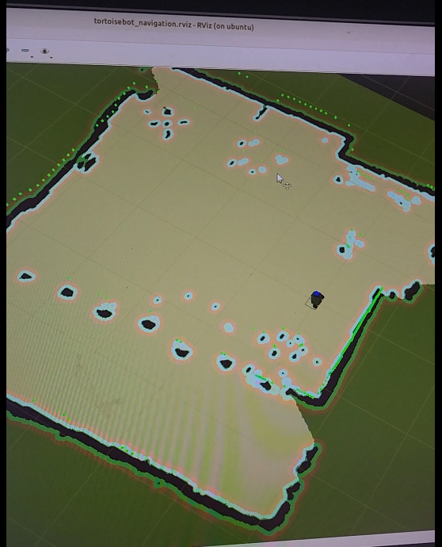

# Checkpoint 20 Tortoisebot and Navigation

command for checkpoint 20

To find tortoisebot IP address

```
nmap -sP 192.168.3.1/24
```

how to ssh

```
ssh tortoisebot@192.168.3.21
```

or if you need to transfer X windows to the working computer

```
ssh -X tortoisebot@192.168.3.21
```


```
username: tortoisebot
password:raspberry
```

All terminal must call

```
noetic
```

before any commands

# To go straight forward in x direction

```
rostopic pub -1 /cmd_vel geometry_msgs/Twist '{linear:  {x: 0.1, y: 0.0, z: 0.0}, angular: {x: 0.0,y: 0.0,z: 0.0}}'
```

# To stop

```
rostopic pub -1 /cmd_vel geometry_msgs/Twist '{linear:  {x: 0, y: 0.0, z: 0.0}, angular: {x: 0.0,y: 0.0,z: 0.0}}'
```


To Visualize the Rviz

```
cd Documents/
rviz -d peerajak_rviz.rviz

```

To save flash drive to file .img

```
 sudo dd if=/dev/sdd of=$PWD/system_boot_2.img status=progress
```


To mount the flash drive save file .img 

- system-boot partition


```
sudo mount -o loop,offset=269484032 system_boot_2.img /media/peerajak/
```

- writable partition


To Unmount the above commands

```
sudo umount /media/peerajak/
```

To overlay the catkin_ws/carto_ws over ros1_ws

```
cd ~/catkin_ws/carto_ws/
source ~/ros1_ws/carto_ws/devel_isolated/setup.bash
cd ~/catkin
rm -rf devel install install_isolated devel_isolated
catkin_make -j1 -l1
source ~/ros1_ws/devel/setup.bash
```

To call overlay workspace

```
source ~/ros1_ws/carto_ws/devel_isolated/setup.bash
source ~/ros1_ws/devel/setup.bash

```

or call 

```
./ros1_ws/chain_setup.bash
```

To check that everything is set up, we need to see both cartographer_ros package and tortoisebot

```
rospack list | grep -e tortoisebot_ -e cartographer_ros
```

We should see this result

cartographer_ros /home/tortoisebot/ros1_ws/carto_ws/install_isolated/share/cartographer_ros
cartographer_ros_msgs /home/tortoisebot/ros1_ws/carto_ws/install_isolated/share/cartographer_ros_msgs
tortoisebot_control /home/tortoisebot/ros1_ws/src/tortoisebot/tortoisebot_control
tortoisebot_description /home/tortoisebot/ros1_ws/src/tortoisebot/tortoisebot_description
tortoisebot_firmware /home/tortoisebot/ros1_ws/src/tortoisebot/tortoisebot_firmware
tortoisebot_gazebo /home/tortoisebot/ros1_ws/src/tortoisebot/tortoisebot_gazebo
tortoisebot_navigation /home/tortoisebot/ros1_ws/src/tortoisebot/tortoisebot_navigation
tortoisebot_slam /home/tortoisebot/ros1_ws/src/tortoisebot/tortoisebot_slam


Test cartographer

To generate a map of the surrounding, first, run the bringup.launch on Robot's terminal

```
roslaunch tortoisebot_firmware bringup.launch
```

Then run server_bringup.launch on the PC

```
roslaunch tortoisebot_firmware server_bringup.launch
```

Then in another terminal launch tortoisebot_slam.launch using:

```
roslaunch tortoisebot_slam tortoisebot_slam.launch
```

This will launch RViz which will be generating Map on the basis of the LiDAR scan that is been received.



